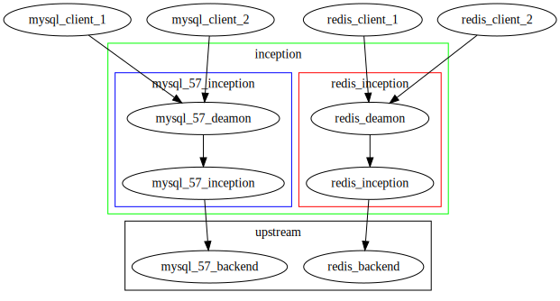

# XInception

- 路线图
  - 增加线上体验地址
  - redis 审核实现
  - mysql 审核实现
  - http  审核实现
  - mqtt  审核实现
  - postgre  审核实现
  - mongodb  审核实现
  
结构 大概就这样了

### 我怎么增加自己的实现

### 需要什么技术栈?

- java
- netty
- tcp/ip
- tcpdump/wireshark
- antlr

### 如何做？ 参考 redis实现 和 mysql实现

- 实现 interface下面的接口就可以

### 授权协议 Apache
